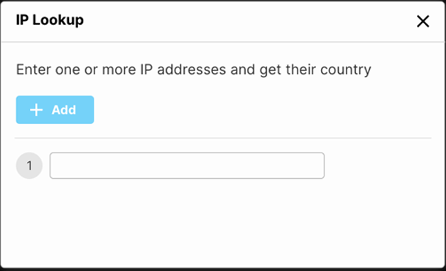
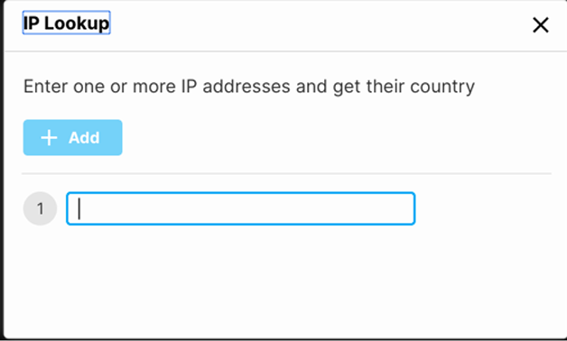
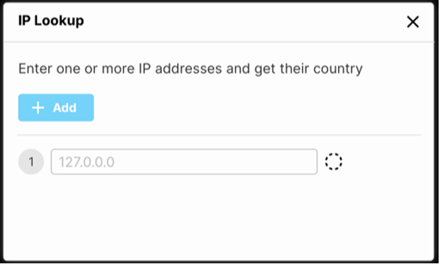
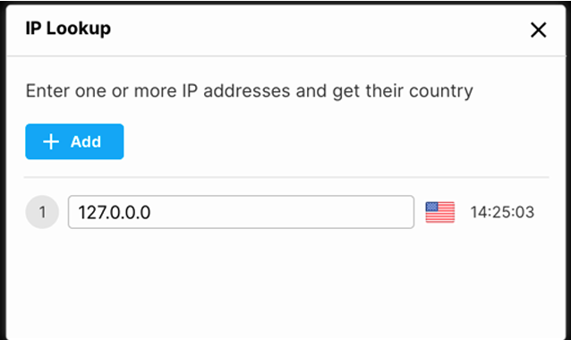

# Frontend Home Assignment

👞 **Home Assignment**

It’s your first day on the job. Everybody is super excited to have you.

There is an urgent task that has been waiting just for you.

So grab a coffee and get coding.

You are tasked with implementing a web application that translates IP addresses into countries.

## 🌟 Phase 1

The page should be based on the attached mocks.

The page should include an **“Add”** button that will add a new row with a label and a textbox.

When the textbox loses focus, perform the search.

You should be able to search several IPs simultaneously.

---

## 🌟 Phase 2

- Textbox should be disabled when searching.
- There should be client-side input validations.
- While searching, show a clear indication regarding the operation status.
- Handle errors in a friendly way.

---

## 🌟 Phase 3

- Once you get the location, the textbox should be enabled again, and you can edit and search for different IPs.
- Show the local time (`hh:mm:ss`) next to the location. The time should be real-time, meaning it needs to be updated.

**Notice:** UI/UX aspects will be taken into consideration, so please pay attention to those matters.

---

## Non-Functional Requirements

At Torq, we use **TypeScript** and **Vue.js 3**. You are free to use whatever you like, but TypeScript and Vue.js 3 will be an advantage.

---

## Bonus

- Write unit tests to cover your code.
- CI/CD.

---
